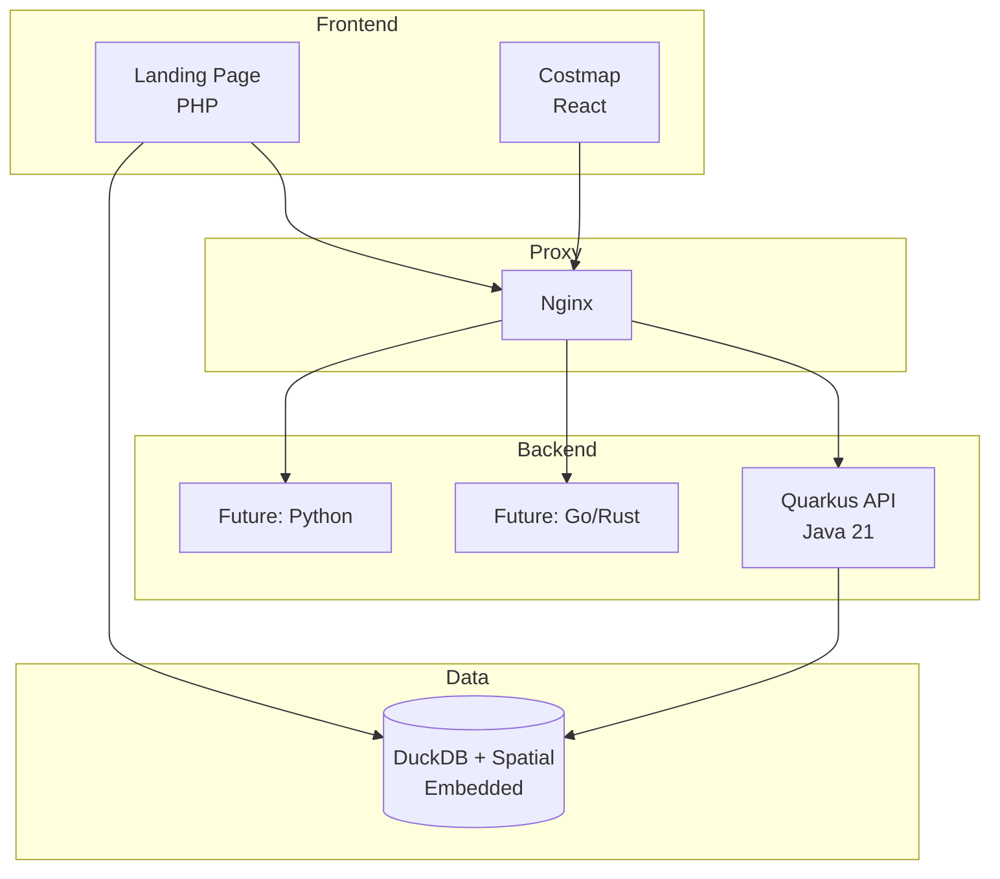

# OpenData.id

Open data platform for Indonesia. Performance-first, beautifully crafted.

## Principles

### 1. Performance First

Performance is the **#1 priority**, regardless of language or framework.

This project aims to be the main beacon for open data in Indonesia. Every design decision prioritizes:

- **Sub-second response times** for all API endpoints
- **Minimal memory footprint** for VPS deployment (4GB target)
- **Zero unnecessary abstractions** in hot paths
- **Compile-time over runtime** (no reflection in critical paths)

We learn from the best: Apache Kafka, Apache Cassandra, DuckDB — systems that handle millions of operations per second.

### 2. Playground, Not a Toy

This is a playground for data engineering and analytics — but **not a toy project**.

- Production-grade code quality from day one
- Real-world data (BPS, Kemnaker, OSM)
- Beautiful UX that respects users' time
- Infrastructure designed for scale

The goal: learn by building something real that serves real users.

## Features

### Live Economic Indicators
- **UMR Statistics** - Highest, lowest, and average minimum wages across Indonesia
- **Real-time data** - Queries DuckDB directly, cached for 5 minutes

### Grocery Prices Ticker
- **15 essential items** - Rice, eggs, chicken, cooking oil, sugar, etc.
- **Source: PIHPS** (Pusat Informasi Harga Pangan Strategis)
- **Daily price changes** with up/down indicators

### Regional Data
- **514 kabupaten/kota** - All regencies and cities
- **34 provinces** - Complete coverage (pre-2022 Papua expansion)
- **Source: BIG (Badan Informasi Geospasial), Kemnaker**

## Architecture



## Tech Stack

| Layer | Technology | Why |
|-------|------------|-----|
| Frontend | React + Vite | Fast builds, simple |
| Backend | Quarkus (Java 21) | Compile-time DI, native-ready |
| Cache | Caffeine | In-memory, high performance |
| Database | DuckDB + Spatial | Embedded, analytical, geo-capable |
| Monorepo | Nx + Bun | Fast, polyglot support |
| Deploy | Nginx + systemd | Simple, no container overhead |

## Code Standards

Inspired by Apache Kafka and Apache Cassandra:

```java
// Immutable records
public record Region(int id, String name, String province) {
    public Region {
        Objects.requireNonNull(name);
    }
}

// No unnecessary abstractions
// No DTOs unless API contract differs from domain
// No "enterprise" patterns for simple CRUD
// Direct, explicit, fast
```

### Package Structure (Feature-based)

```
costmap/
├── region/
│   ├── Region.java
│   ├── RegionRepository.java
│   └── RegionResource.java
├── wage/
│   └── ...
└── config/
    └── DuckDBConfig.java
```

## Projects

### Costmap (Living Cost Index)

Interactive map showing living costs across Indonesian regions:
- Minimum wages (UMR) by kabupaten/kota
- Cost of living by category
- Search by budget/salary

**Status:** In development

## Quick Start

```bash
# Install dependencies
make install

# Run development servers
make dev-landing        # PHP    @ localhost:3000
make dev-costmap-web    # React  @ localhost:5173
make dev-costmap-api    # Quarkus @ localhost:8080

# Initialize database
make db-init
```

## Documentation

- [Setup Guide](docs/SETUP.md)
- [Design System](docs/DESIGN_SYSTEM.md)
- [Data Sources](docs/DATA_SOURCES.md)

## Performance

### Caching Strategy
- **In-memory cache (Caffeine)** - GeoJSON responses cached for 24h
- **Gzip compression** - 69% size reduction for map data
- **Pre-computed provinces** - Dissolved boundaries stored in DB

### Current Metrics

| Endpoint | Cold | Cached | Size (gzip) |
|----------|------|--------|-------------|
| `/api/regions/provinces/geojson` | 0.8s | 0.3s | 0.5MB |
| `/api/regions/geojson` | 2.6s | 0.8s | 1.5MB |
| List APIs | < 100ms | < 50ms | < 10KB |

### Scaling Notes
- Single VPS handles ~100 concurrent users easily
- For 1K+ concurrent: add Cloudflare (free tier)
- For 10K+ concurrent: CDN + edge caching required

## License

MIT
